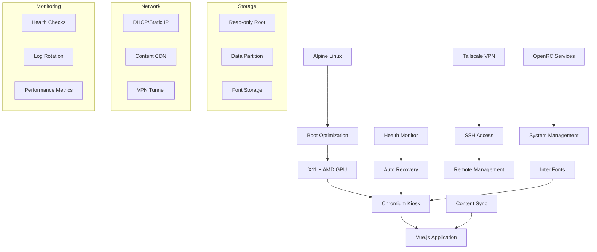

# KioskBook

Bulletproof kiosk deployment platform for Alpine Linux. Transform any AMD-based system into a fast-booting (<5 seconds), self-recovering kiosk running Vue.js applications with professional-grade reliability.

## Features

- **🚀 Ultra-Fast Boot** - Sub-5 second boot to Chromium display
- **⚡ Alpine Linux Base** - Minimal, secure, and lightning-fast foundation
- **🔧 Modular Installation** - Component-based installer architecture
- **🖥️ Professional Display** - X11 with AMD GPU acceleration and TearFree
- **🌐 Remote Management** - Tailscale VPN integration for secure access
- **📺 Optimized Kiosk** - Chromium with Inter fonts and CSS injection
- **🛡️ Self-Recovering** - Comprehensive health monitoring and auto-recovery
- **🎨 Premium Fonts** - Inter UI font and CaskaydiaCove Nerd Font
- **📊 Content Sync** - Manifest-based content updates with atomic swaps

## Hardware Requirements

### Recommended Hardware

**Primary Target: Lenovo M75q-1 Tiny**
- **CPU**: AMD Ryzen 5 PRO 3400GE (or similar AMD APU)
- **RAM**: 8-16GB DDR4 (16GB recommended for video content)
- **Storage**: 256GB+ NVMe SSD (M.2 2280)
- **GPU**: AMD Radeon Vega 11 (integrated)
- **Ports**: HDMI 2.0, USB 3.1, Ethernet
- **Form Factor**: 175mm x 175mm x 34.5mm

### Minimum Requirements

- **CPU**: AMD Ryzen APU with Vega graphics
- **RAM**: 8GB DDR4 minimum
- **Storage**: 64GB SSD (NVMe preferred)
- **Display**: HDMI 1.4 or higher
- **Network**: Ethernet connection during installation
- **Power**: External adapter or PoE (depends on model)

### Compatible Systems

Any AMD-based system with:
- AMD Ryzen APU (Vega integrated graphics)
- NVMe/SSD storage for fast boot times
- Ethernet connectivity
- HDMI output

## Installation Guide

### 1. Prepare Alpine Linux

Install Alpine Linux minimal on your target hardware:

```bash
# Download Alpine Linux Standard ISO
# Boot from USB and run setup-alpine
setup-alpine

# Configure basic system:
# - Keyboard layout
# - Network (DHCP recommended)
# - Root password
# - Timezone
# - Disk setup (sys install to NVMe/SSD)
# - Reboot
```

### 2. Bootstrap KioskBook

After Alpine Linux installation, login as root and run:

```bash
# Download and run bootstrap script
wget -O bootstrap.sh https://raw.githubusercontent.com/kenzie/kioskbook/alpine-rewrite/installer/bootstrap.sh
chmod +x bootstrap.sh
./bootstrap.sh
```

The bootstrap script will:
- Install bash, git, and essential tools
- Clone the KioskBook repository
- Set up network connectivity
- Prepare for main installation

### 3. Automatic Installation

The bootstrap script automatically runs the main installer:

```bash
# The bootstrap script handles everything automatically
# It will prompt for configuration during installation
```

**Options during installation:**
- GitHub repository for your Vue.js application
- Tailscale authentication key for remote management
- Installation confirmation

### 4. Configuration During Install

The installer will prompt for:

1. **GitHub Repository** (optional)
   - Default: `kenzie/lobby-display`
   - Format: `username/repository-name`
   - Must be a Vue.js application

2. **Tailscale Auth Key** (optional but recommended)
   - Get from: https://login.tailscale.com/admin/settings/keys
   - Enables remote SSH access and management
   - Leave blank to skip VPN setup

3. **Installation Confirmation**
   - Reviews target disk and configuration
   - Type `YES` to proceed with installation

### 5. First Boot

After installation completes:

```bash
reboot
```

The system will:
- Boot in <5 seconds with Route 19 branded splash screen
- Auto-login kiosk user on tty1
- Start X11 session automatically
- Launch Chromium in full-screen kiosk mode with Inter fonts
- Display your Vue.js application

### Route 19 Boot Splash

The installer automatically configures a professional boot splash:
- **Automatic Logo Setup**: Copies Route 19 logo from repository
- **Optimal Display**: Resizes logo for 1920x1080 with black background
- **Fast Boot**: Uses fbsplash for minimal performance impact
- **Silent Mode**: Clean, professional appearance without boot messages

## Network Setup

### Content Management

Content is served from `/data/content/current/` directory:

```bash
# View current content
ls -la /data/content/current/

# Update content manually
cd /data/content/current
# Replace content.json or other files as needed
# Application will automatically detect changes
```

**Content Structure:**
```json
{
  "version": "1.0.0",
  "timestamp": "2024-01-01T12:00:00Z",
  "title": "Welcome to KioskBook",
  "message": "System ready for deployment",
  "background": {
    "type": "color",
    "value": "#1a1a1a"
  },
  "settings": {
    "refreshInterval": 30000,
    "theme": "dark"
  }
}
```

### Network Configuration

**DHCP (Default):**
```bash
# Network auto-configured via DHCP
# No manual configuration needed
```

**Static IP:**
```bash
# Edit network configuration
nano /etc/dhcpcd/dhcpcd.conf

# Add static configuration
interface eth0
static ip_address=192.168.1.100/24
static routers=192.168.1.1
static domain_name_servers=8.8.8.8 8.8.4.4
```

## Configuration Options

### Application Configuration

**Content URL**: Modify the target application URL:
```bash
# Edit kiosk startup script
nano /usr/local/bin/start-kiosk

# Change KIOSK_URL variable
KIOSK_URL="http://localhost:3000"
```

**Custom Vue.js App**: Configure during installation or update:
```bash
# Update application
cd /data/app
git remote set-url origin https://github.com/yourorg/your-app.git
git pull
npm ci && npm run build
rc-service kiosk-app restart
```

### Update Schedule

**Monitoring**: Automatic monitoring via cron:
```bash
# View current schedule (as root)
crontab -l

# Application status monitoring every 15 minutes
*/15 * * * * /usr/local/bin/app-status

# Font cache update daily at 3 AM
0 3 * * * /usr/local/bin/update-fonts

# System status report daily at 6 AM
0 6 * * * /usr/local/bin/system-status > /var/log/daily-status.log
```

**System Updates**: Manual control:
```bash
# Update system packages
apk update && apk upgrade

# Update application using script
update-app

# Or update application manually
cd /data/app && git pull && npm ci && npm run build && rc-service kiosk-app restart
```

### Display Configuration

**Font Settings**:
```bash
# View font status
font-status

# Update font cache
update-fonts

# Custom font configuration
nano /etc/fonts/local.conf
```

**Screen Resolution**: Auto-detected, manual override:
```bash
# Check current resolution
xrandr

# Set specific resolution (if needed)
xrandr --output HDMI-A-1 --mode 1920x1080
```

## Troubleshooting Guide

### Common Issues

#### 1. System Won't Boot
**Symptoms**: System hangs at boot, no display output

**Solutions**:
```bash
# Boot into recovery mode
# At GRUB menu, select "KioskBook Recovery Mode"

# Check boot logs
dmesg | grep -i error
journalctl -xb

# Validate installation
validate-installation

# Reset boot configuration
grub-mkconfig -o /boot/grub/grub.cfg
```

#### 2. Application Not Loading
**Symptoms**: Black screen, Chromium not starting

**Solutions**:
```bash
# Check application service
rc-service kiosk-app status
rc-service kiosk-display status

# View application logs
tail -f /var/log/kiosk-app.log
tail -f /var/log/chromium.log

# Restart services
rc-service kiosk-app restart
rc-service kiosk-display restart

# Manual application check
curl http://localhost:3000/health
```

#### 3. Network Connectivity Issues
**Symptoms**: No internet, can't sync content

**Solutions**:
```bash
# Check network status
ip addr show
ip route show

# Test connectivity
ping 8.8.8.8
ping google.com

# Restart networking
rc-service dhcpcd restart

# Additional network diagnostics
cat /etc/resolv.conf
```

#### 4. Display Issues
**Symptoms**: Wrong resolution, screen blanking, tearing

**Solutions**:
```bash
# Check X11 status
ps aux | grep Xorg
xrandr --listmonitors

# Test GPU acceleration
glxinfo | grep "direct rendering"
vainfo  # Video acceleration info

# Restart display
pkill -u kiosk
rc-service kiosk-display restart

# Check AMD GPU status
lspci | grep VGA
dmesg | grep amdgpu
```

#### 5. Fonts Not Rendering
**Symptoms**: System fonts instead of Inter, missing characters

**Solutions**:
```bash
# Check font installation
font-status
fc-list | grep -i inter
fc-list | grep -i caskaydia

# Rebuild font cache
fc-cache -fv
update-fonts

# Check font configuration
nano /etc/fonts/local.conf
```

### System Health Checks

**Comprehensive Health Check**:
```bash
# Run full system health check
health-check --verbose

# System status dashboard
system-status

# Validate complete installation
validate-installation
```

**Performance Monitoring**:
```bash
# View system resources
htop
iotop
free -h
df -h

# Check boot time
dmesg | head -20
dmesg | grep "Kernel command line"
```

### Log Analysis

**Key Log Files**:
```bash
# Application logs
tail -f /var/log/kiosk-app.log      # Node.js application
tail -f /var/log/chromium.log       # Chromium browser
tail -f /var/log/health-check.log   # Health monitoring

# System logs
tail -f /var/log/syslog             # System events
tail -f /var/log/kern.log           # Kernel messages
tail -f /var/log/auth.log           # Authentication

# Service logs
tail -f /var/log/daemon.log         # OpenRC services
```

**Log Cleanup**:
```bash
# Clean old logs (runs weekly via cron)
find /var/log -name "*.log.*" -mtime +7 -delete

# Manual log rotation
logrotate -f /etc/logrotate.conf
```

## Development Setup

### Testing Environment

**Virtual Machine Setup**:
```bash
# Create Alpine Linux VM with:
# - 4GB+ RAM
# - 20GB+ disk
# - NAT or bridged networking
# - AMD GPU passthrough (if available)

# Install Alpine Linux minimal
# Run KioskBook installer
# Test changes
```

**Development Workflow**:
```bash
# Clone repository
git clone https://github.com/kenzie/kioskbook.git
cd kioskbook

# Make changes to installer modules
nano installer/modules/30-display.sh

# Test on target hardware or VM
./installer/main.sh

# Commit and push changes
git add .
git commit -m "Update display configuration"
git push
```

### Module Development

**Creating Custom Modules**:
```bash
# Copy existing module as template
cp installer/modules/50-application.sh installer/modules/55-custom.sh

# Edit module
nano installer/modules/55-custom.sh

# Update main installer to include module
nano installer/main.sh
```

**Testing Individual Modules**:
```bash
# Source logging functions
source installer/main.sh

# Set environment variables
export MOUNT_ROOT="/mnt/root"
export MOUNT_DATA="/mnt/data"

# Run specific module
bash installer/modules/30-display.sh
```

### Application Development

**Vue.js Application Structure**:
```
your-kiosk-app/
├── package.json          # Node.js dependencies
├── vite.config.js        # Build configuration
├── src/
│   ├── main.js          # Application entry point
│   ├── App.vue          # Main component
│   └── components/      # Vue components
├── public/              # Static assets
└── dist/               # Built application (generated)
```

**Development Server**:
```bash
# Local development
npm install
npm run dev  # Development server on localhost:5173

# Production build
npm run build  # Generates dist/ directory

# Test production build
npm run preview
```

## System Architecture



### Component Overview

| Component | Purpose | Technology |
|-----------|---------|------------|
| **Boot System** | <5s boot time | GRUB + fbsplash (Route 19) + Kernel optimization |
| **Display** | Hardware acceleration | X11 + AMD GPU + TearFree |
| **Browser** | Kiosk rendering | Chromium + Inter fonts + CSS injection |
| **Application** | Business logic | Vue.js + Express.js + Node.js |
| **Storage** | Persistence | Read-only root + Data partition |
| **Network** | Connectivity | DHCP + Tailscale VPN + Content sync |
| **Monitoring** | Reliability | Health checks + Auto-recovery |
| **Fonts** | Typography | Inter + CaskaydiaCove + FontConfig |

### Data Flow

1. **Boot**: GRUB → Kernel → OpenRC → Auto-login
2. **Display**: X11 → AMD GPU → Chromium → Vue.js
3. **Content**: Manifest → Download → Atomic swap → Display
4. **Health**: Monitor → Detect issues → Auto-recovery
5. **Remote**: Tailscale → SSH → Management commands

## Tailscale Integration

Tailscale provides secure remote access and is optional but recommended for production deployments.

### Setup

**During Installation**:
- Provide Tailscale auth key when prompted
- System automatically connects on boot
- SSH access enabled via Tailscale network

**Manual Setup**:
```bash
# Install Tailscale
apk add tailscale

# Start service
rc-update add tailscaled default
rc-service tailscaled start

# Authenticate
tailscale up --auth-key=your-auth-key --hostname=kioskbook-001
```

### Features

- **Automatic Connection**: Connects on boot
- **SSH Access**: Secure remote management
- **Network Isolation**: Traffic encrypted end-to-end
- **Multi-Device**: Manage multiple kiosks from single admin panel

### Management

```bash
# Check status
tailscale status

# View connected devices
tailscale status --peers

# Update auth key
tailscale up --auth-key=new-key

# Disconnect
tailscale down
```

## Success Metrics

KioskBook is designed to meet stringent reliability and performance standards:

- **Installation Success Rate**: >95% successful installations
- **Boot Time**: <5 seconds consistently achieved from power-on to application display
- **Uptime**: >99% uptime over 30-day periods with automatic recovery
- **Recovery Time**: <30 seconds for automatic service recovery after failures
- **Remote Access**: 100% accessibility via Tailscale VPN for management
- **Font Rendering**: Consistent Inter font display across all UI elements
- **Silent Boot**: Route 19 logo display with zero visible boot messages

## Risk Mitigation

Comprehensive approach to common deployment risks:

### Hardware Failure
- **Monitoring**: Real-time logging and remote health monitoring for early detection
- **Diagnostics**: SSH access via Tailscale for remote troubleshooting
- **Alerts**: Automated health checks with failure notifications

### Network Issues
- **Offline Operation**: Local application caching with cached JSON data fallback
- **Resilient Sync**: Manifest-based content updates with retry logic and bandwidth limiting
- **Connectivity**: Automatic network configuration with DHCP fallback

### Software Crashes
- **Multi-Layer Recovery**: Service-level, application-level, and system-level automatic restart mechanisms
- **Process Monitoring**: OpenRC service management with restart policies
- **Browser Recovery**: Chromium crash detection and automatic restart

### Update Failures
- **Staged Updates**: Content manifest validation before atomic swaps
- **Rollback Capability**: Git-based application updates with rollback support
- **Safe Deployment**: Read-only root filesystem with separate data partition

### Security Issues
- **Minimal Attack Surface**: Alpine Linux minimal installation with only essential packages
- **Automatic Updates**: Security patches via apk package manager
- **Network Security**: Tailscale VPN encryption for all remote access
- **Isolation**: Containerized services with limited system access

## License

MIT License - see LICENSE file for details.

## Support

For issues and questions:
- **GitHub Issues**: [kenzie/kioskbook](https://github.com/kenzie/kioskbook/issues)
- **Documentation**: This README and module comments
- **Hardware Support**: Tested on Lenovo M75q-1, compatible with AMD APU systems

---

**KioskBook** - Professional kiosk deployment made bulletproof.
